# Ultra-low-cost AWTRIX build

AWTRIX is an awesome and very flexible visualization companion for smart home and other application.
It was initially designed to be flashed to the Ulanzi pixel clock, which currently comes at a price of 50 USD, but it also supports custom builds.
I wanted a full featured custom build with professional look but at a much lower pricepoint than the original, but didn't find a good howto - so I created this one.

Full source code for AWTRIX available here: [AWTRIX repo](https://github.com/Blueforcer/awtrix3) 

Features:
- Base build is under 20 USD, full feature set about 25USD
- 32*8px display with light-diffusor for pixel look
- Clean "fullblack" effect when off  
- Three menu buttons
- Stylable by easily exchangeable covers with different colors and touch
- Preparation for wall hanging mount
- and stand supports
- Optional light sensor 
- Optional DF Player MP3 sound
- Optional buzzer

Note that I didn't foresee support for the battery and the battery sensor as I don't think this is a beneficial feature due to the high power demands of the display. 

Also the temperature/humidity sensor I did not include in the housing as the heat dissipation from the display will hinder any accurate reading when using a sensor in the same housing. Alternartively use a regular separate weather station sensor and display its reading to the AWTRIX screen.

# Index
- [Standard parts](#standard_parts)
- [Note on 3D printed parts](#note_on_3d_printed_parts)
- [Step 1: Diffusor](#step_1_diffusor)
- [Step 2: Base](#step_2_base)
- [Step 3: Pushbuttons](#step_3_pushbuttons)
- [Step 4: Covers](#step_4_covers)
- [Step 5: Anti-slip pads](#step_5_antislip_pads)
- [Customization ideas](#customization_ideas)
- [Acknowledgements](#Acknowledgements)

## Standard parts

Mandatory parts:

| Unit price | Quantity | Partname | Example | Notes |
| ---------- | -------- | -------- | ------- | ----- |
| 5 USD      | 1        | ESP32 Dev Module | <a href="https://de.aliexpress.com/item/1005006124752051.html">AliExpress</a> | Case designed for WROVER USB-C type. Other types also fit but might be glued |
| 8 USD      | 1        | WS2812B matrix 8x32 | <a href="https://de.aliexpress.com/item/4001296811800.html">AliExpress</a> |  |
| 1 USD      | 1        | 4 pushbutton element | <a href="https://de.aliexpress.com/item/1005007177677170.html">AliExpress</a> | When using the 4 buttons element, connect the outputs for the two middle buttons to "or" their signal. Unsolder the LED to get cleaner look |
| 2 USD      | 1        | semi-transparent acrylic board | <a href="https://de.aliexpress.com/item/32857098929.html">AliExpress</a> | Optional, for cleaner look. Best when using semi-transparent black acryl. 2mm thickness hold tight in case. Thinner sheets need to be glued to base. Peace of at least 338*98mm required.  |
| <1 USD     | 25       | Flathead screws M2,5 or M3. 6mm. e.g. DIN 7984 | <a href="https://de.aliexpress.com/item/1005006166060947.html">AliExpress</a> | Use low head version if possible for best look ("laptop screws") |

Optional parts:

| Unit price | Quantity | Partname | Example | Notes |
| ---------- | -------- | -------- | ------- | ----- |
| 1 USD      | 1        | DF Player mini | <a href="https://de.aliexpress.com/item/1005006263283726.html">AliExpress</a> | Optional, for MP3 playback |
| 1 USD      | 1        | Loudspeaker 8 Ohm | <a href="https://de.aliexpress.com/item/1005006358049156.html">AliExpress</a> | Optional, for MP3 playback. Watch for dimensions |
| <1 USD     | 1        | Buzzer | <a href="https://de.aliexpress.com/item/1005004883467830.html">AliExpress</a> | Optional, for signaling |
| <1 USD     | 1        | LDR GL5516 | <a href="https://de.aliexpress.com/item/1005005693826904.html">AliExpress</a> | Optional, for auto brightness |

## Note on 3D printed parts

Printer settings:
- All printed parts designed for PETG besides for the anti-slip pads (TPU) or the diffusor (worked best on PLA). 
- Best experience on my printer was to print the part in the direction as shown in the thumbnails
- no supports needed unless explicitely noted
- Using fuzzy skin for all outside walls creates a nice look
- No rafts/brim etc. reguired for any model.

## Step 1: Diffusor

3D-Printed Parts:

| Filename                           | Thumbnail                                              | Required | Notes |
| ---------------------------------- | -------------------------------------------------------| -------- | ------|
| `./print/diffusor/diffusor.stl`    | 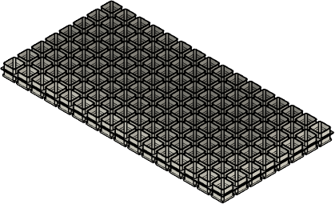   | 2        | Standard white PLA gave best diffusor effect |
| `./print/diffusor/grid_middle.stl` |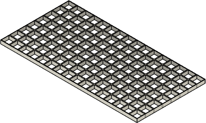 | 2        | Use full black PETG for best stability and contrast |
| `./print/diffusor/grid_side.stl`   |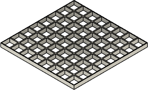   | 4        | Use full black PETG for best stability and contrast |

Assembly:
- Snap in the grids to the diffusor from both directions
- Use the larger "middle grid" to tie both diffusor part together as shown in assembly animation
- One outside wall of the "diffusor_side" is a little thinner than the other wall. Use this to face to the middle grid to achieve best look  
- make sure the upper grid is fully pressed in so that surface of diffusor and grid is fully leveled, this may require some force

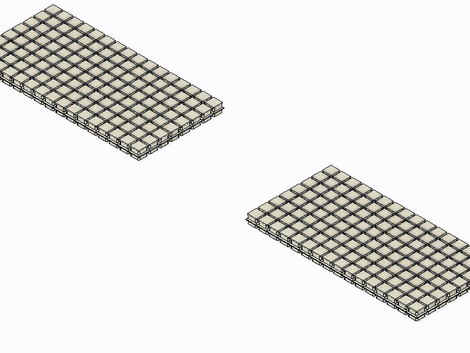

## Step 2: Base

Note: no part of the base will be visible any longer once the cover is attached, so you can use up leftover filament

| Filename                            | Thumbnail                                                | Required | Notes |
| ----------------------------------- | ---------------------------------------------------------| -------- | ------|
| `./print/base/base_left.stl`        | 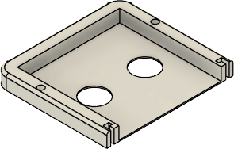        | 1        | Invisible in assembled state |
| `./print/base/base_right.stl`       |         | 1        | Invisible in assembled state |
| `./print/base/base_middle.stl`      | 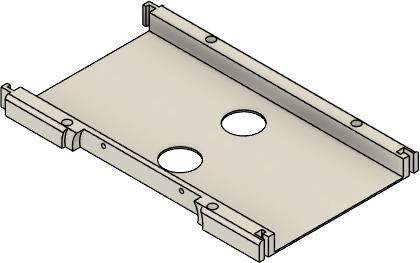      | 1        | Invisible in assembled state |
| `./print/base/base_lower_left.stl`  | 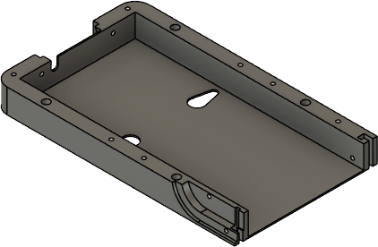  | 1        | Invisible in assembled state |
| `./print/base/base_lower_right.stl` | 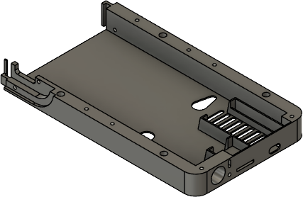 | 1        | Invisible in assembled state |

## Step 3: Pushbuttons

| Filename                                    | Thumbnail                                                        | Required | Notes |
| ------------------------------------------- | -----------------------------------------------------------------| -------- | ------|
| `./print/pushbutton/pushbutton_base.stl`    | 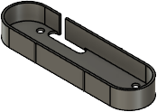    | 1        | Invisible in assembled state |
| `./print/pushbutton/pushbutton_clicker.stl` | 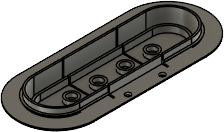 | 1        | Make sure to print in the depicted direction and enable light supports |

## Step 4: Covers

Notes:
- Consider fuzzy skin for outside walls
- Use a nice color to personalize your AWTRIX
- Priting in depicted direction requires supports only at the location of the pushbuttons (consider disable auto supports and use paint-on supports at these locations)

| Filename                        | Thumbnail                                            | Required | Notes |
| ------------------------------- | -----------------------------------------------------| -------- | ------|
| `./print/cover/cover_left.stl`  | 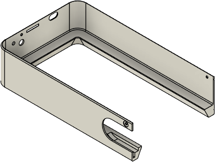  | 1        |       |
| `./print/cover/cover_right.stl` | 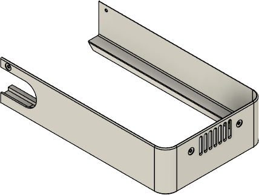 | 1        |       |

Cut the acrylic board as shown:

## Step 5: Anti-slip pads
Optionally you might want to add TPU [anti-slip pads](./print/antislip/antislip.stl) to the AWTRIX which gives it a solid stand in laying (8 pads) and/or upright position (3 pads).
Assemble these pads at the indicated locations on the base and cover via double sided tape. 

Alternatively you can use standard non-slip pads or even cut peaces of standard rubber pads and attach them with double sided tape.

Location of the pads for upright position:
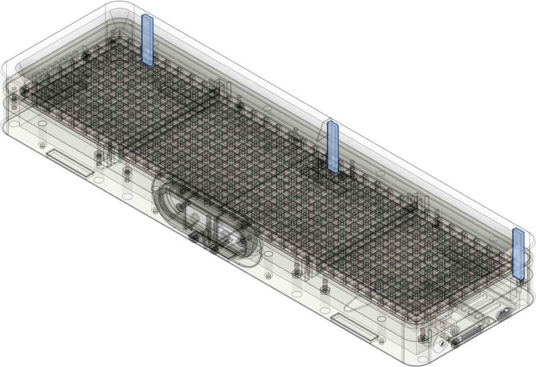

Location of the pads for laying or wall hanging position:
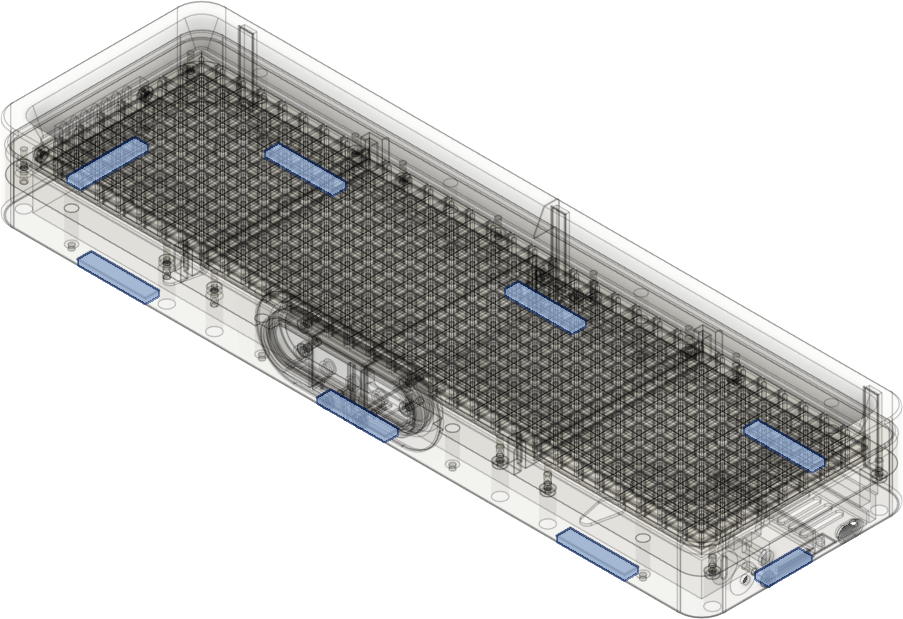

## Customization ideas

The housing offers some mechanical customzation options:
- add all the optional features such as the buzzer
- print covers in different colors and use different colors for pushbutton and cover
- use fuzzy skin or other effects for cover

## Acknowledgements
- Blueforcer for launching awesome AWTRIX3 project 

