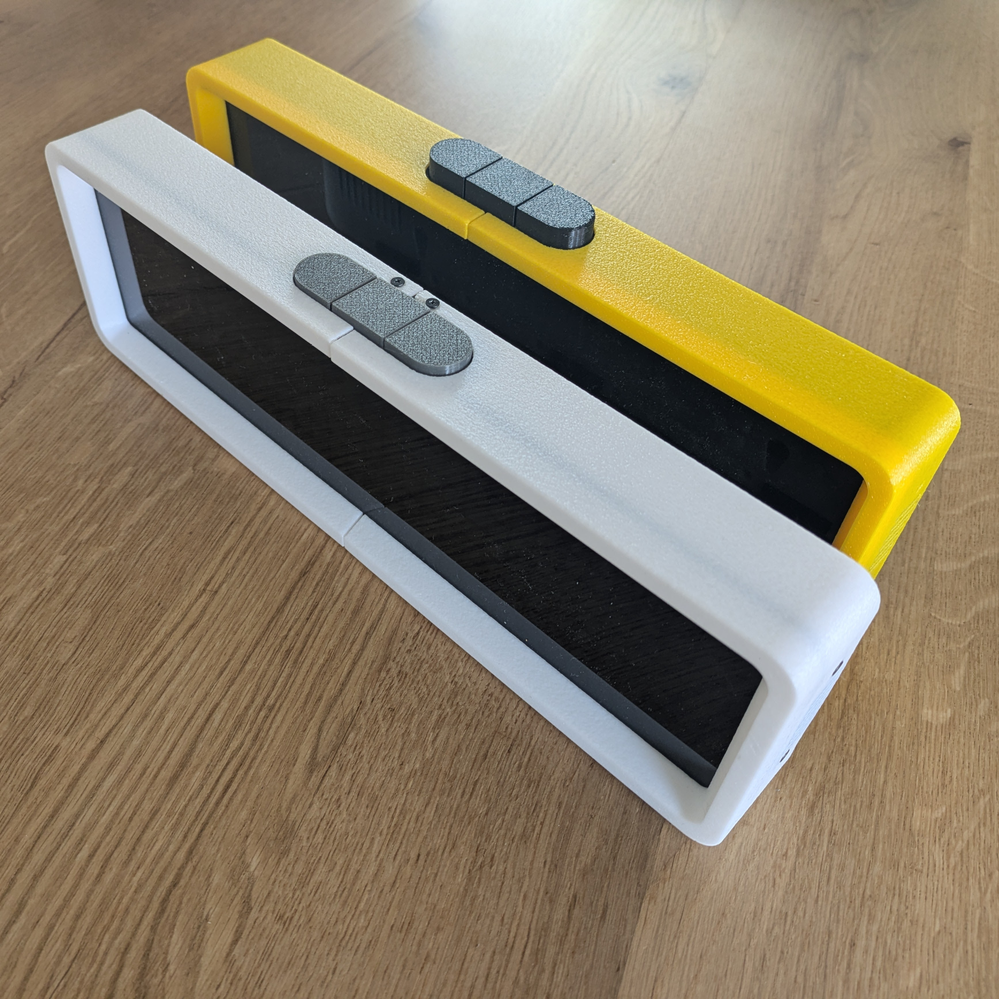

# Ultra-low-cost AWTRIX build

AWTRIX is an amazing and highly flexible visualization companion for smart home applications and more. Originally designed to be flashed onto the Ulanzi Pixel Clock (priced at around $50), it also supports custom builds.

I wanted to create a fully featured custom build with a professional look but at a much lower price point than the original. Since I couldn’t find a comprehensive guide, I decided to create one myself.

Full source code for AWTRIX available here: [AWTRIX repo](https://github.com/Blueforcer/awtrix3) 

Features:
- <B>Affordable</B>: Base build costs under $20, while the full feature set is around $25.
- <B>3D Printer Friendly</B>: Designed to fit most popular 3D printers with a minimum bed size of 175mm.
- <B>High-Quality Display</B>: 32x8 pixel WS2812B LED matrix with a light diffuser for a clean "pixelated" look and a sleek "full black" effect when turned off.
- <B>Customizable Design</B>: Easily interchangeable covers in different colors and textures.
- <B>Flexible Mounting</B>: Can be wall-mounted using nails or screws, or used as a standing or laying device.
- <B>Optional Features</B>:
    - Light sensor for automatic brightness adjustment.
    - DFPlayer Mini for MP3 playback.
    - Buzzer for notifications or alarms.

Notes:
- <B>Battery Support</B>: This build does not include battery support, as the high power demands of the display make it impractical.
- <B>Temperature/Humidity Sensor</B>: A sensor is not included in the housing because the heat generated by the display would affect accuracy. Instead, you can use an external weather station sensor and display its readings on the AWTRIX screen.

Examples:
| Time/date (AWTRIX build in) | Spotify (Custom app) | Customization Example (Different Covers) |
| --------------------------- | -------------------- | --------------------------------------- |
| |  | |

# Index
- [Buy parts](#buy-parts)
- [Printing and assembly](#printing-and-assembly)
- [Customization ideas](#customization-ideas)
- [Acknowledgements](#Acknowledgements)

## Buy parts

Mandatory parts:

| Unit price | Quantity | Partname | Example | Notes |
| ---------- | -------- | -------- | ------- | ----- |
| 5 USD      | 1        | ESP32 Dev Module | <a href="https://de.aliexpress.com/item/1005006124752051.html">AliExpress</a> | Designed for WROVER USB-C type. Other types fit but may require glue |
| 8 USD      | 1        | WS2812B matrix 8x32 | <a href="https://de.aliexpress.com/item/4001296811800.html">AliExpress</a> |  |
| 1 USD      | 1        | 4 pushbutton element | <a href="https://de.aliexpress.com/item/1005007177677170.html">AliExpress</a> | Connect the outputs of the two middle buttons to "OR" their signal. Unsolder the LED for a cleaner look. |
| 2 USD      | 1        | semi-transparent acrylic board | <a href="https://de.aliexpress.com/item/32857098929.html">AliExpress</a> | Optional. Best results with semi-transparent black acrylic (2mm thick). Thinner sheets may need glue. Minimum size: 338x98mm. |
| <1 USD     | 25       | Flathead screws M2,5 or M3. 6mm. e.g. DIN 7984 | <a href="https://de.aliexpress.com/item/1005006166060947.html">AliExpress</a> | Use low-head screws (e.g., laptop screws) for a better appearance. |

Optional parts:

| Unit price | Quantity | Partname | Example | Notes |
| ---------- | -------- | -------- | ------- | ----- |
| 1 USD      | 1        | DF Player mini | <a href="https://de.aliexpress.com/item/1005006263283726.html">AliExpress</a> | For MP3 playback |
| 1 USD      | 1        | Loudspeaker (8 Ohm) | <a href="https://de.aliexpress.com/item/1005006358049156.html">AliExpress</a> | For MP3 playback. Watch for dimensions |
| <1 USD     | 1        | Buzzer | <a href="https://de.aliexpress.com/item/1005004883467830.html">AliExpress</a> | For notifications or alarms. |
| <1 USD     | 1        | LDR (GL5516) | <a href="https://de.aliexpress.com/item/1005005693826904.html">AliExpress</a> | For automatic brightness adjustment. |

## Printing and assembly

| 45° | top | -45° | back |
| -------- | --- | --------- | ---- |
|  |  |  |  |

The printing and assembly process consist of 5 steps:
- [Step 1: Diffusor](./instructions/step_1.md)
- [Step 2: Base](./instructions/step_2.md)
- [Step 3: Pushbuttons](./instructions/step_3.md)
- [Step 4: Covers](./instructions/step_4.md)
- [Step 5: Anti-slip pads](./instructions/step_5.md)

Printer Settings:
- <B>Material</B>: PETG for most parts, TPU for anti-slip pads, and PLA for the diffuser.
- <B>Orientation</B>: Print parts as shown in the thumbnails for the best results.
- <B>Infill</B>: 20% Gyroid infill with Hilbert curve for first/top layers.
- <B>Supports</B>: Not required unless explicitly mentioned.
- <B>Surface Finish</B>: Use "fuzzy skin" for a textured look on outer walls.
- <B>Rafts/Brims</B>: Not required for any model.

## Customization ideas

The housing offers several customization options:
- Add optional features like the buzzer or light sensor.
- Print covers in different colors or textures.
- Use effects like "fuzzy skin" for a unique appearance.

## Acknowledgements
- Special thanks to Blueforcer for creating the incredible AWTRIX3 project.

