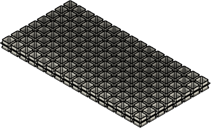
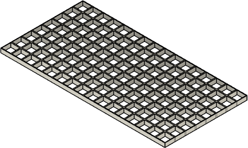
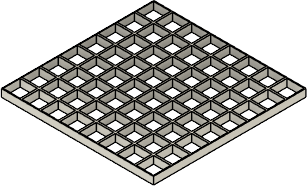
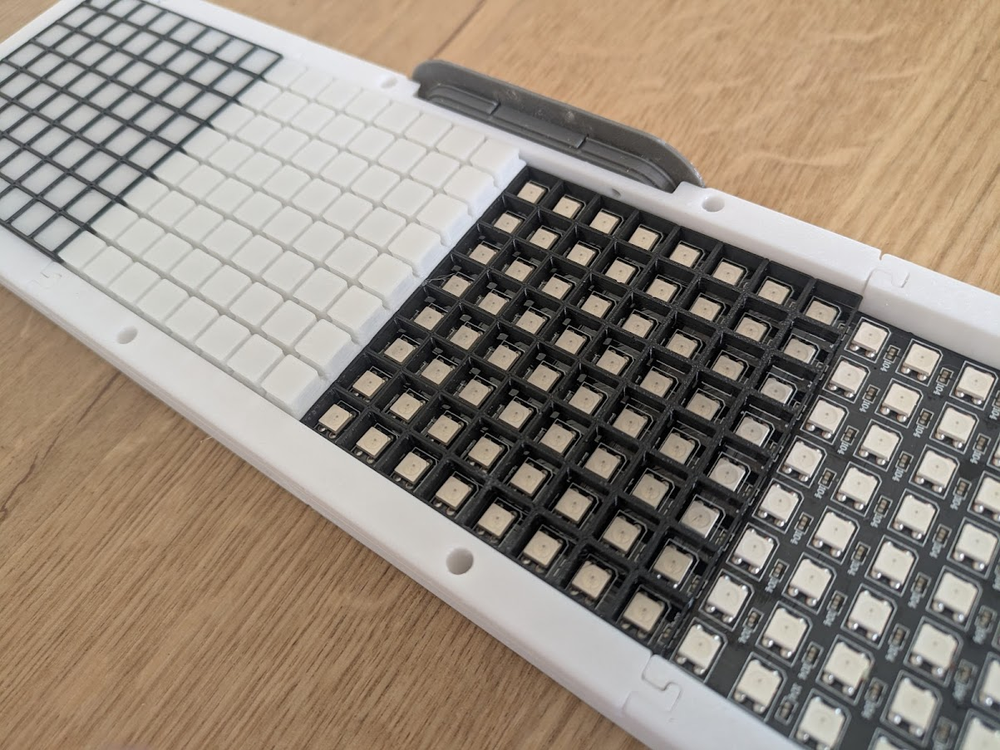

# Step 1: Diffusor

3D-Printed Parts:

| Filename                            | Thumbnail                               | Required | Notes |
| ----------------------------------- | --------------------------------------- | -------- | ------|
| `../print/diffusor/diffusor.stl`    |     | 2        | Standard white PLA gave best diffusor effect |
| `../print/diffusor/grid_middle.stl` |  | 2        | Use full black PETG for best stability and contrast |
| `../print/diffusor/grid_side.stl`   |    | 4        | Use full black PETG for best stability and contrast |

Assembly:
- Snap in the grids to the diffusor from both directions
- Use the larger "middle grid" to tie both diffusor part together as shown in assembly animation
- One outside wall of the "diffusor_side" is a little thinner than the other wall. Use this to face to the middle grid to achieve best look  
- make sure the upper grid is fully pressed in so that surface of diffusor and grid is fully leveled, this may require some force

Detailed view of the different layers of the diffusor in its final assembly position:

[Next step](./step_2.md) | 
[Back to overview](../README.md) 