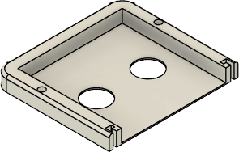
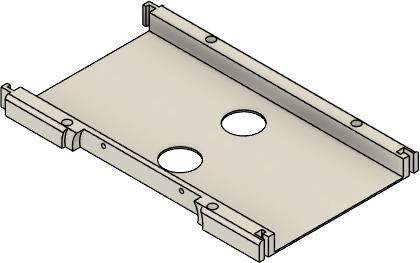
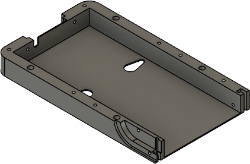
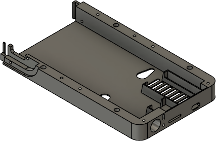
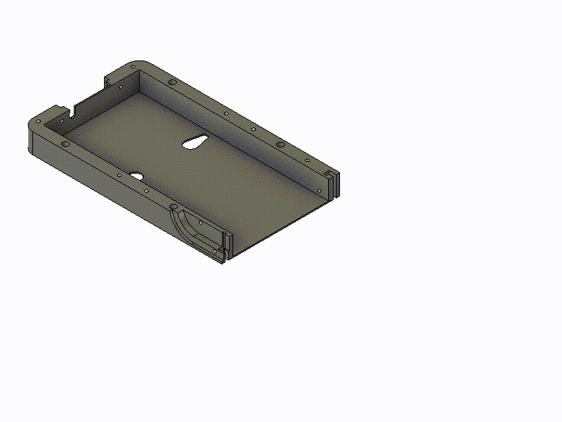

# Step 2: Base

Note: no part of the base will be visible any longer once the cover is attached, so you can use up leftover filament

| Filename                             | Thumbnail                                | Required | Notes |
| ------------------------------------ | -----------------------------------------| -------- | ------|
| `../print/base/base_left.stl`        |         | 1        | Invisible in assembled state |
| `../print/base/base_right.stl`       |         | 1        | Invisible in assembled state |
| `../print/base/base_middle.stl`      |       | 1        | Invisible in assembled state |
| `../print/base/base_lower_left.stl`  |   | 1        | Invisible in assembled state |
| `../print/base/base_lower_right.stl` |  | 1        | Invisible in assembled state |

Assembly:
- Connect the parts of the lower base via the locks 
- Most electronics go into the lower part of the base (ESP, DF player, buzzer, loudspeaker, LDR). Make sure to have them installed before going on
- Connect the parts of the upper base via the locks
- The WS2812 LED grid is laid in the sunken part of the upper base. Solder the connection wires to the matrix and connect them to the electronics in the lower base
- Prepare push button assembly by soldering the wires of the 4 button module to the ESP and make them stick out the holes  
- Put upper part of base atop of lower part
- Screw both parts toger via screws from bottom (the screw holes on the upper part are foreseen for wall hangings via screws)

[Previous step](./step_1.md) |
[Next step](./step_3.md) |
[Back to overview](../README.md) 