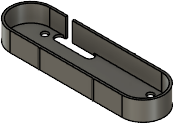
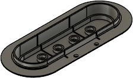
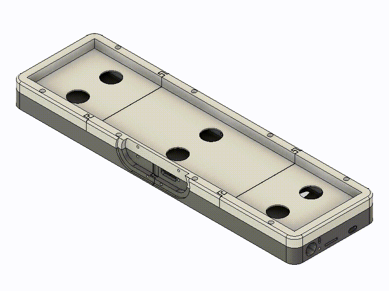

# Step 3: Pushbuttons

| Filename                                     | Thumbnail                                        | Required | Notes |
| -------------------------------------------- | ------------------------------------------------ | -------- | ------|
| `../print/pushbutton/pushbutton_base.stl`    |     | 1        | Invisible in assembled state |
| `../print/pushbutton/pushbutton_clicker.stl` |  | 1        | Make sure to print in the depicted direction and enable light supports |

Assembly:
- Place 4 button module PCN on top of pushbutton base and screws it to the base
- Press pushbutton top "clicker" to the 4 button module. Each button's hat need to fit into one of the foreseen holes in the clicker 

[Previous step](./step_2.md) |
[Next step](./step_4.md) |
[Back to overview](../readme.md) 