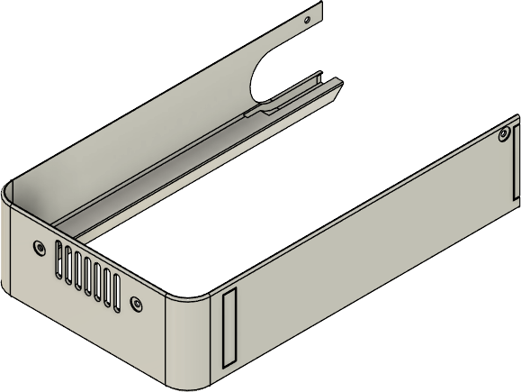
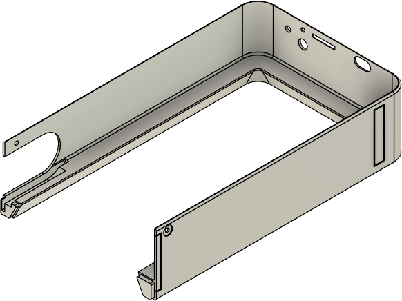
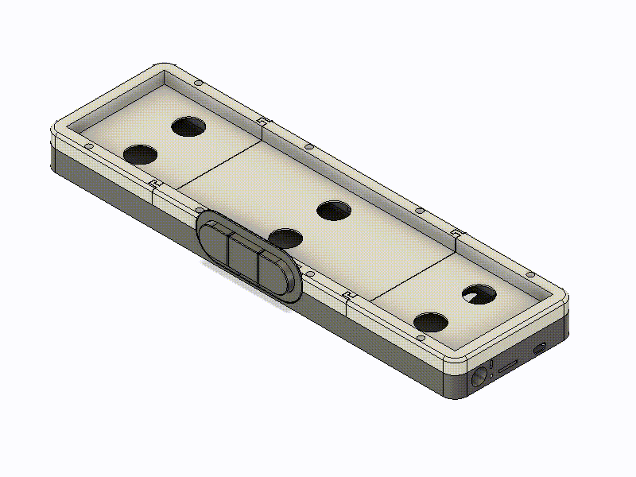

# Step 4: Covers

Notes:
- Consider fuzzy skin for outside walls
- Use a nice color to personalize your AWTRIX
- Priting in depicted direction requires supports only at the location of the pushbuttons (consider disable auto supports and use paint-on supports at these locations)

| Filename                         | Thumbnail                            | Required | Notes |
| -------------------------------- | ------------------------------------ | -------- | ------|
| `../print/cover/cover_left.stl`  |   | 1        |       |
| `../print/cover/cover_right.stl` |  | 1        |       |

Cut the acrylic board as shown:

Assembly:
- Place the diffusor on top of the LED matrix in the sunken part of the upper base. Adjust the peaces in a way that the surface of the diffusor aligns with the one of the upper base
- place the acrylic board on top of the base and diffusor
- Slide both parts of the cover on the base with the diffusor and acrylic board
- Screw the cover to the base 

[Previous step](./step_3.md) |
[Next step](./step_5.md) |
[Back to overview](../readme.md) 