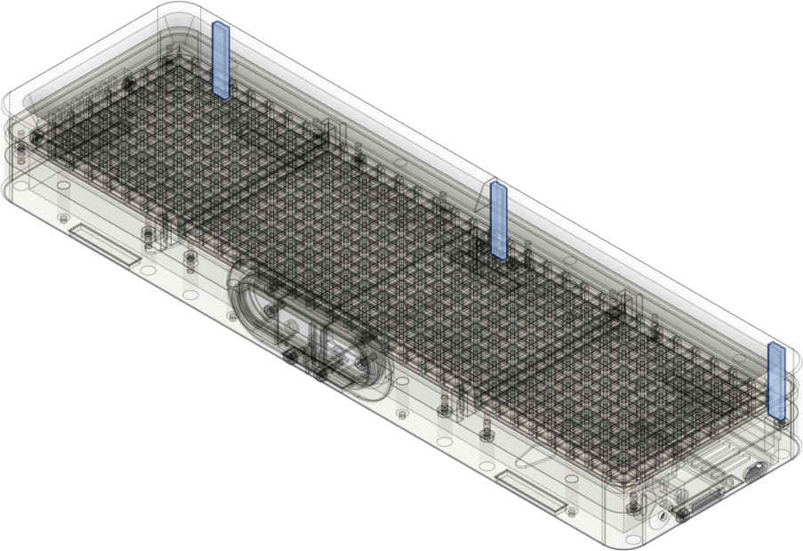
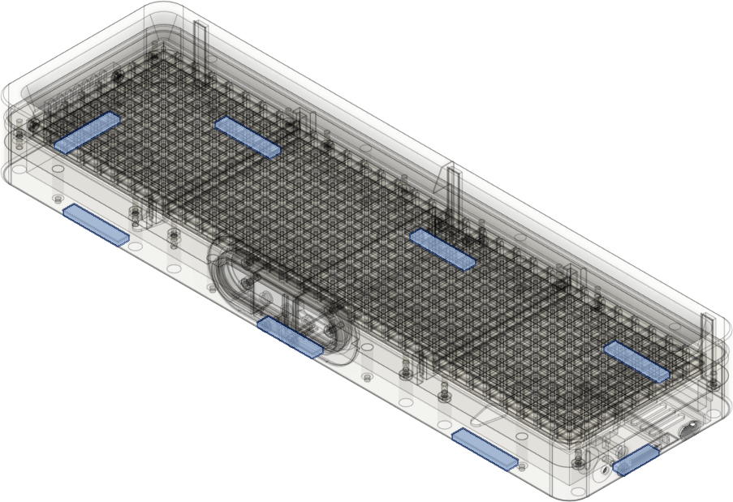

# Step 5: Anti-slip pads
Optionally you might want to add TPU [anti-slip pads](../print/antislip/antislip.stl) to the AWTRIX which gives it a solid stand in laying (8 pads) and/or upright position (3 pads).
Assemble these pads at the indicated locations on the base and cover via double sided tape. 

Alternatively you can use standard non-slip pads or even cut peaces of standard rubber pads and attach them with double sided tape.

Location of the pads for upright position:

Location of the pads for laying or wall hanging position:

[Previous step](./step_4.md) |
[Back to overview](../README.md) 